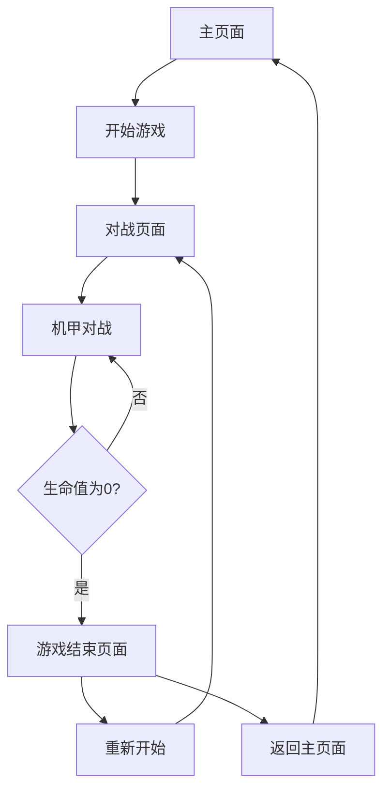

## 1. Product Overview
像素风机甲对战小游戏是一款复古风格的2D格斗游戏，玩家可以控制机甲角色进行对战。
- 游戏主要面向喜欢复古游戏风格和机甲题材的玩家，提供简单易上手但富有策略性的对战体验
- 产品价值在于提供休闲娱乐，同时展示复古像素艺术风格的魅力

## 2. Core Features

### 2.1 User Roles
| Role | Registration Method | Core Permissions |
|------|---------------------|------------------|
| Player | 无需注册 | 控制机甲角色进行游戏 |

### 2.2 Feature Module
1. **游戏主页面**: 游戏标题、开始按钮、操作说明
2. **游戏对战页面**: 机甲角色、战斗场景、生命值显示、胜负判定
3. **游戏结束页面**: 胜负结果、重新开始按钮

### 2.3 Page Details
| Page Name | Module Name | Feature description |
|-----------|-------------|---------------------|
| 游戏主页面 | 标题区域 | 显示游戏名称和像素风格logo |
| 游戏主页面 | 控制按钮 | 提供开始游戏按钮和操作说明按钮 |
| 游戏对战页面 | 机甲角色 | 两个可控制的机甲角色，支持移动、攻击、防御操作 |
| 游戏对战页面 | 战斗场景 | 复古像素风格的战斗背景和场景元素 |
| 游戏对战页面 | 生命值系统 | 显示双方机甲的生命值，生命值为0时判定失败 |
| 游戏对战页面 | 操作提示 | 显示当前可执行的操作和按键说明 |
| 游戏结束页面 | 结果显示 | 显示游戏胜负结果和战斗统计 |
| 游戏结束页面 | 重新开始 | 提供重新开始游戏的按钮 |

## 3. Core Process
游戏流程：玩家进入主页面 → 点击开始游戏 → 进入对战页面 → 控制机甲进行战斗 → 一方生命值为0时游戏结束 → 显示游戏结果 → 选择重新开始或返回主页面

## 4. User Interface Design
### 4.1 Design Style
- 主色调：深蓝色(#1a1a2e)和亮橙色(#ff7700)作为主色，灰色(#808080)作为辅助色
- 按钮风格：像素风格，有轻微的3D效果，点击时有反馈动画
- 字体：使用像素风格字体，如Press Start 2P
- 布局风格：居中布局，简洁明了
- 图标风格：8位像素风格的图标和动画

### 4.2 Page Design Overview
| Page Name | Module Name | UI Elements |
|-----------|-------------|-------------|
| 游戏主页面 | 标题区域 | 像素风格的游戏logo，使用Press Start 2P字体，字体大小24px，颜色为亮橙色(#ff7700)，背景为深蓝色(#1a1a2e) |
| 游戏主页面 | 控制按钮 | 开始游戏按钮：像素风格，大小150x50px，背景色#ff7700，文字颜色#ffffff，悬停时有轻微放大效果 |
| 游戏对战页面 | 机甲角色 | 16x16像素的机甲精灵，包含 idle、move、attack、defend、hit 等动画帧 |
| 游戏对战页面 | 战斗场景 | 像素风格的城市背景，包含建筑和地面元素，颜色以深色为主，突出机甲角色 |
| 游戏对战页面 | 生命值系统 | 顶部显示双方生命值条，使用绿色(#00ff00)表示生命值，红色(#ff0000)表示伤害 |
| 游戏对战页面 | 操作提示 | 底部显示当前可执行的操作和按键说明，使用像素字体，颜色为白色(#ffffff) |
| 游戏结束页面 | 结果显示 | 居中显示"胜利"或"失败"文字，使用Press Start 2P字体，字体大小20px，颜色为亮橙色(#ff7700) |
| 游戏结束页面 | 重新开始 | 像素风格按钮，大小120x40px，背景色#ff7700，文字颜色#ffffff |

### 4.3 Responsiveness
- 游戏设计为桌面优先，支持键盘操作
- 界面会根据窗口大小自动调整，保持游戏元素的比例
- 在移动设备上，提供虚拟按键支持

### 4.4 3D Scene Guidance
- 游戏为2D像素风格，不包含3D场景