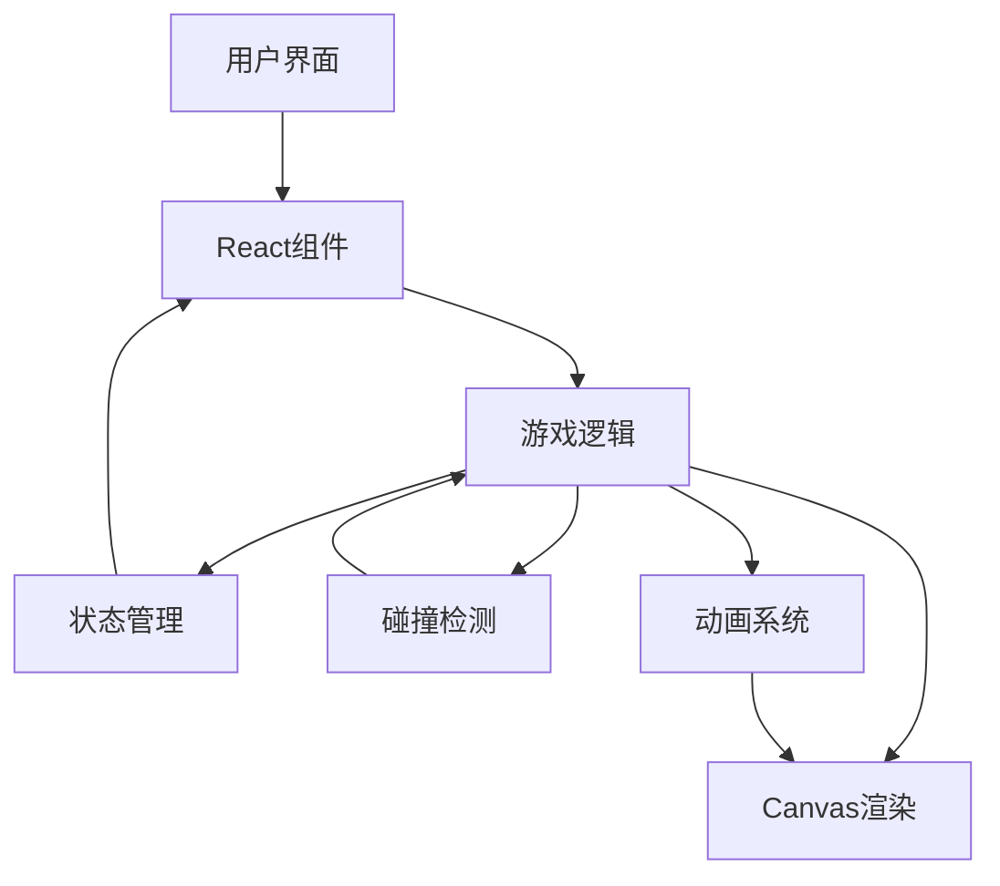
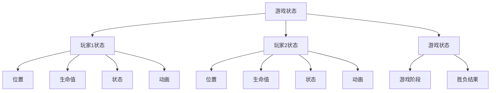

## 1. Architecture Design


## 2. Technology Description
- Frontend: React@18 + TypeScript + Tailwind CSS
- Initialization Tool: Vite
- Game Rendering: HTML5 Canvas API
- State Management: Zustand
- Animation: RequestAnimationFrame
- Build Tool: Vite

## 3. Route Definitions
| Route | Purpose |
|-------|---------|
| / | 游戏主页面 |
| /game | 游戏对战页面 |
| /game-over | 游戏结束页面 |

## 4. Data Model
### 4.1 Data Model Definition


### 4.2 Data Structure
```typescript
// 游戏状态接口
interface GameState {
  players: Player[];
  gamePhase: 'menu' | 'playing' | 'gameOver';
  winner: number | null; // 1, 2, 或 null
}

// 玩家状态接口
interface Player {
  id: number;
  position: { x: number; y: number };
  health: number;
  maxHealth: number;
  state: 'idle' | 'moving' | 'attacking' | 'defending' | 'hit';
  direction: 'left' | 'right';
  animationFrame: number;
  cooldowns: {
    attack: number;
    defend: number;
  };
}
```

## 5. Technical Implementation Details
### 5.1 Game Loop
- 使用 `requestAnimationFrame` 实现游戏主循环
- 每帧更新游戏状态、处理输入、检测碰撞、渲染画面

### 5.2 Input Handling
- 监听键盘事件，处理玩家输入
- 玩家1控制：WASD移动，J攻击，K防御
- 玩家2控制：方向键移动，1攻击，2防御

### 5.3 Collision Detection
- 实现简单的矩形碰撞检测
- 检测机甲之间的碰撞和攻击范围

### 5.4 Animation System
- 精灵动画系统，支持不同状态的动画切换
- 使用 sprite sheet 或逐帧动画实现机甲动作

### 5.5 Rendering
- 使用 Canvas API 绘制游戏场景和角色
- 分层渲染：背景、角色、UI元素

### 5.6 State Management
- 使用 Zustand 管理游戏状态
- 集中处理游戏逻辑和状态更新

## 6. Project Structure
```
/src
  /components
    /Game
      GameCanvas.tsx       # 游戏渲染组件
      GameControls.tsx     # 游戏控制组件
      GameUI.tsx           # 游戏UI组件
    /Pages
      HomePage.tsx         # 主页面
      GamePage.tsx         # 游戏对战页面
      GameOverPage.tsx     # 游戏结束页面
  /hooks
    useGameLoop.ts         # 游戏循环钩子
    useInput.ts            # 输入处理钩子
  /store
    gameStore.ts           # 游戏状态管理
  /utils
    collision.ts           # 碰撞检测工具
    animation.ts           # 动画工具
  /assets
    /sprites               # 精灵图资源
    /sounds                # 音效资源
  App.tsx                  # 应用入口
  main.tsx                 # 主文件
```

## 7. Performance Optimization
- 使用 `requestAnimationFrame` 实现平滑动画
- 精灵图预加载和缓存
- 减少不必要的重渲染
- 优化碰撞检测算法

## 8. Testing Strategy
- 单元测试：测试游戏逻辑和工具函数
- 集成测试：测试组件和状态管理
- 性能测试：确保游戏运行流畅
- 兼容性测试：确保在不同浏览器中正常运行